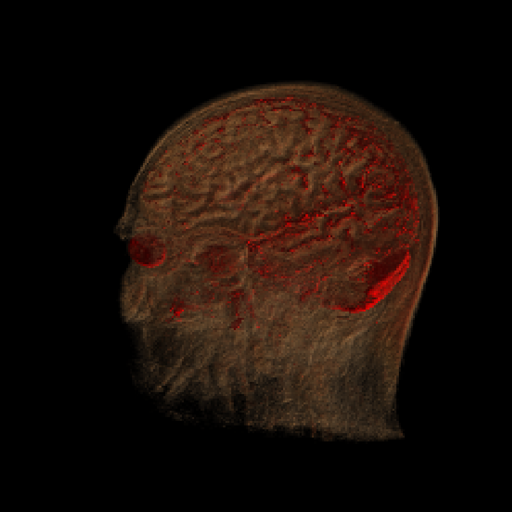

# Cosmic-ray showers simulator

Fast cosmic ray shower simulator.

Author: [Tomasz Hachaj](https://sppr.up.krakow.pl/hachaj/) based on Python code by Łukasz Bibrzycki 

Run a MainWindow.java file. In order to start a simulation you have to undergo following steps:
- Click "Choose experiment file" button to select an experiment configuration. You may choose already prepared "examples/random_test/parameters.conf" file.
- Select "Simulation->Simulation plan summary" in order to view a summary of the experiment.
- Select "Simulation->Run" to start a simulation. An experiment has to have the "results" subfolder to store results.

Configuration file is a CSV with following columns:
- id - unique integer;
- th - theta, rotation coefficients;
- phi - phi, rotation coefficients; 
- r0 - shower distribution parameter;  
- offsetX, offsetY - offset of hit from middle of the simulation (in centimetres) ;
- N - number of particles of shower; 
- sampleSizeX, sampleSizeY - number of centimetres per sample grid;
- regionSizeX, regionSizeY - simulation region size (in centimetres);
- backgroundMezonsPerSquaredCentimeter - number of background mesons per square centimetre;
- calculateBackground, calculateHit - reserved for future, not used;
- detectorsFile - file with detectors position;
- outputDir - output directory for results, should be existing subfolder of experiment directory
- outputImageScale - if > 0 an output image of the experiment fill be produced. Should be a fraction i.e. 0.1, 0.5, 0.01 etc. Too large files will take a long time to calculate.

Detectors configuration file is CSV with following columns:
- id - unique integer;
- x, y - position of centre of detector (in meters), position is relative to centre of experiment grid (not an impact of shower!);
- w, h - detectors size (in meters)

Simulation generated a set of files for each unique id in experiment configuration file.
- Detections files holds information about position of detection in grid (in meters), if it is a shower particle hit or a background particle hit and detector id.
- Detectors files hold information about each detector and how many particles it has registered.

Use scripts GenerateDetectors.py to generate random distribution of not overlapping detectors.

Use scripts GenerateImage.py to visualize results of experiment.

If you have questions, concerns, remarks contact author: [Tomasz Hachaj](https://sppr.up.krakow.pl/hachaj/).

Have a nice day! =)
